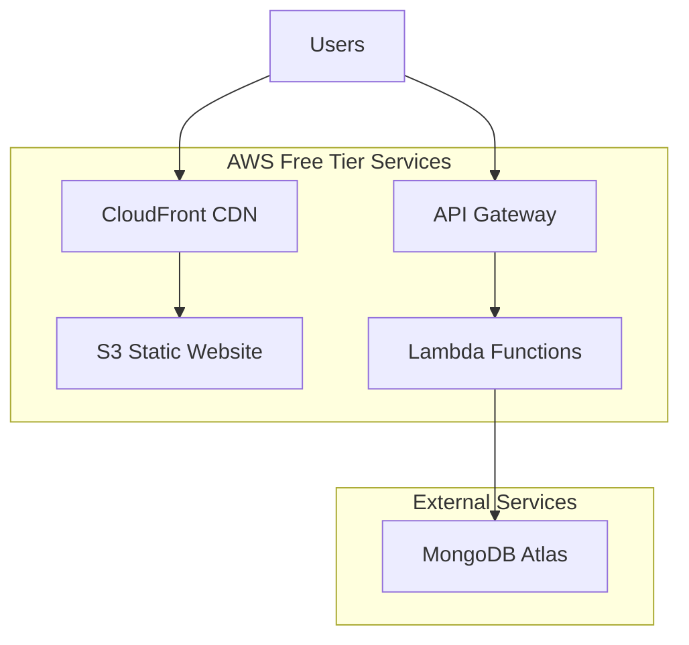

# Design Document

## Overview

This design implements a cost-effective AWS deployment architecture for the Campus Vibe full-stack application, optimized for 300 average users and 2000 peak concurrent users while maintaining costs under $50/month. The architecture leverages AWS free tier services and serverless technologies to minimize operational overhead and costs.

## Architecture

### High-Level Architecture



### Service Selection Rationale

**Frontend Hosting: S3 + CloudFront**

- S3 provides 5GB free storage and 15GB data transfer
- CloudFront offers 1TB data transfer and 10M requests free
- Total cost for traffic: ~$0-5/month

**Backend Hosting: Lambda + API Gateway**

- Lambda free tier: 1M requests + 400,000 GB-seconds compute
- API Gateway free tier: 1M requests
- Estimated cost for 2000 peak users: ~$10-20/month

**Database: MongoDB Atlas (Existing)**

- Already configured and running
- No migration costs or downtime

### Cost Analysis

| Service     | Free Tier    | Expected Usage      | Estimated Cost |
| ----------- | ------------ | ------------------- | -------------- |
| Lambda      | 1M requests  | 500K requests/month | $0-5           |
| API Gateway | 1M requests  | 500K requests/month | $0-3           |
| S3          | 5GB storage  | 1GB                 | $0             |
| CloudFront  | 1TB transfer | 100GB               | $0             |
| **Total**   |              |                     | **$0-8/month** |

## Components and Interfaces

### Frontend Component (React SPA)

**Technology Stack:**

- React 18.2.0 with React Router
- Tailwind CSS for styling
- Axios for API communication
- Build output: Static files for S3

**Deployment Configuration:**

- Build command: `npm run build`
- Output directory: `client/build/`
- Environment variables: API Gateway URL
- CDN optimization: Gzip compression, caching headers

### Backend Component (Node.js Lambda)

**Technology Stack:**

- Node.js 18.x runtime (ARM64 for cost efficiency)
- Express.js with serverless-http adapter
- Existing middleware: CORS, helmet, rate limiting
- MongoDB connection with connection pooling

**Lambda Configuration:**

- Memory: 256MB (optimal cost/performance)
- Timeout: 15 seconds
- Architecture: ARM64 (20% cost savings)
- Reserved concurrency: 100 (prevents runaway costs)

### API Gateway Configuration

**Setup:**

- REST API with proxy integration
- CORS enabled for frontend domain
- Request/response transformations
- Rate limiting: 1000 requests/minute per IP
- Caching: 5-minute TTL for GET requests

### Database Integration

**MongoDB Atlas Connection:**

- Existing connection string maintained
- Connection pooling optimized for Lambda
- Read/write operations through existing Mongoose models
- No changes required to data layer

## Data Models

### Existing Models (No Changes Required)

- Comment.js - Forum comments
- Course.js - Academic course information
- Faculty.js - Faculty reviews and ratings
- Item.js - Marketplace items
- Question.js - Forum questions
- Review.js - Course/faculty reviews
- Slot.js - Timetable slots
- Timetable.js - Student timetables
- Vote.js - Voting system

### Environment Configuration

**Production Environment Variables:**

```
NODE_ENV=production
MONGODB_URI=<existing_atlas_connection>
JWT_SECRET=<secure_jwt_secret>
ADMIN_SECRET=<admin_access_secret>
EMAIL_USER=<email_service_user>
EMAIL_PASS=<email_service_password>
EMAIL_SERVICE=gmail
FRONTEND_URL=<cloudfront_distribution_url>
```

## Error Handling

### Lambda Error Handling

- Graceful degradation for database connection issues
- Proper HTTP status codes for all error scenarios
- CloudWatch logging for debugging
- Dead letter queue for failed requests

### Frontend Error Handling

- API error boundaries with user-friendly messages
- Retry logic for transient failures
- Offline detection and messaging
- Loading states for all async operations

### Monitoring and Alerting

- CloudWatch metrics for Lambda performance
- API Gateway request/error metrics
- Cost monitoring with billing alerts
- Performance monitoring with response time tracking

## Testing Strategy

### Pre-Deployment Testing

1. **Local Development Testing**

   - Serverless offline for local Lambda testing
   - React development server with proxy to local API
   - Environment variable validation

2. **Staging Environment**
   - Deploy to separate AWS stage
   - End-to-end testing of all features
   - Load testing with simulated traffic

### Production Testing

1. **Smoke Tests**

   - Health check endpoints
   - Database connectivity verification
   - Authentication flow validation

2. **Performance Testing**
   - Response time monitoring
   - Concurrent user simulation
   - Memory and timeout optimization

### Automated Testing

- GitHub Actions for CI/CD pipeline
- Automated deployment on main branch push
- Rollback capability for failed deployments

## Security Considerations

### API Security

- CORS configured for specific frontend domain
- Rate limiting to prevent abuse
- JWT token validation for protected routes
- Input validation and sanitization

### Infrastructure Security

- IAM roles with minimal required permissions
- Environment variables encrypted at rest
- HTTPS enforcement for all communications
- S3 bucket policies for public read access only

### Data Protection

- MongoDB Atlas encryption in transit and at rest
- No sensitive data in Lambda logs
- Secure email service configuration
- User data validation and sanitization

## Deployment Strategy

### Blue-Green Deployment

- Serverless framework handles versioning
- API Gateway stage management
- CloudFront cache invalidation
- Zero-downtime deployments

### Rollback Strategy

- Lambda version management
- API Gateway stage rollback
- S3 object versioning for frontend
- Database migration rollback procedures

### Monitoring and Maintenance

- CloudWatch dashboards for key metrics
- Automated cost alerts
- Performance monitoring
- Regular security updates
